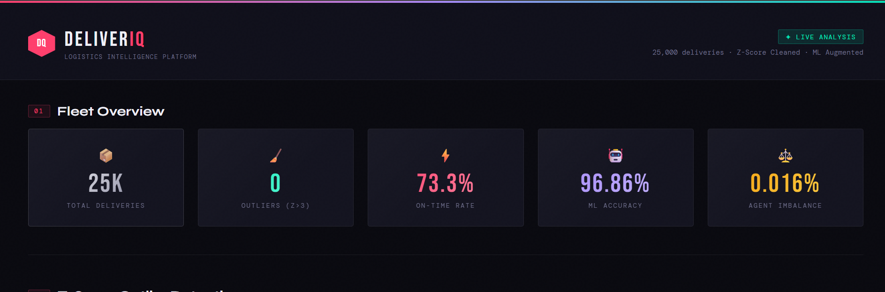
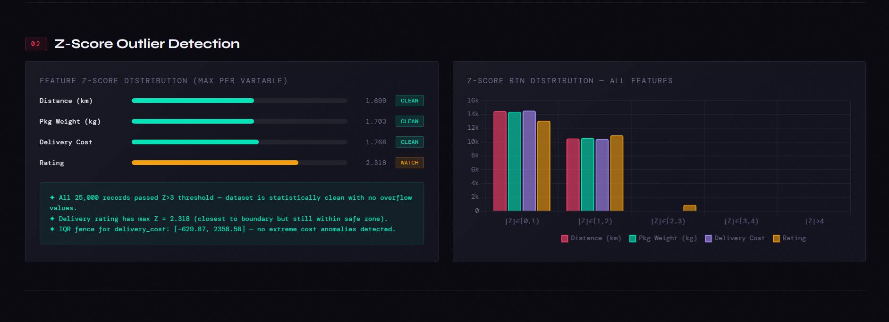
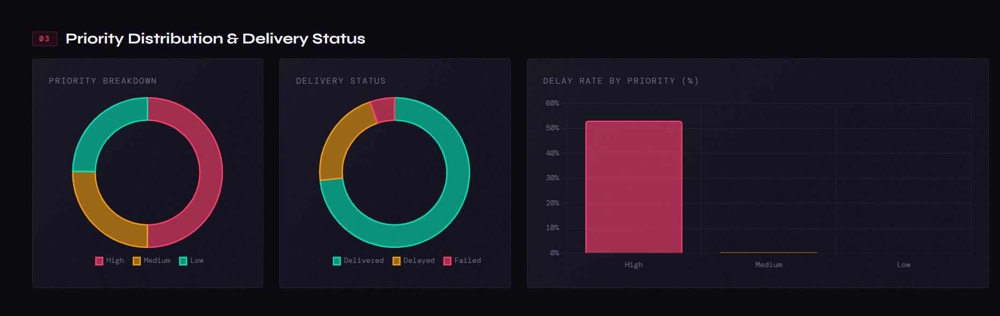
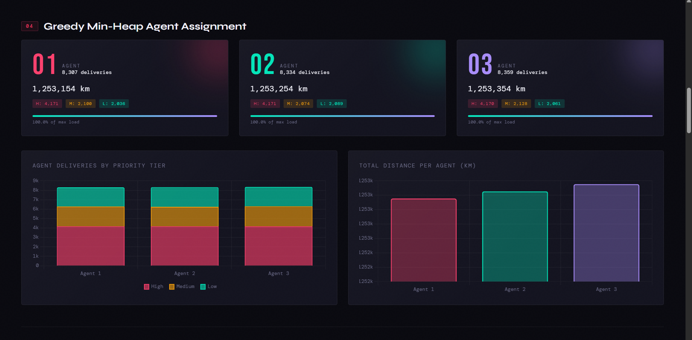
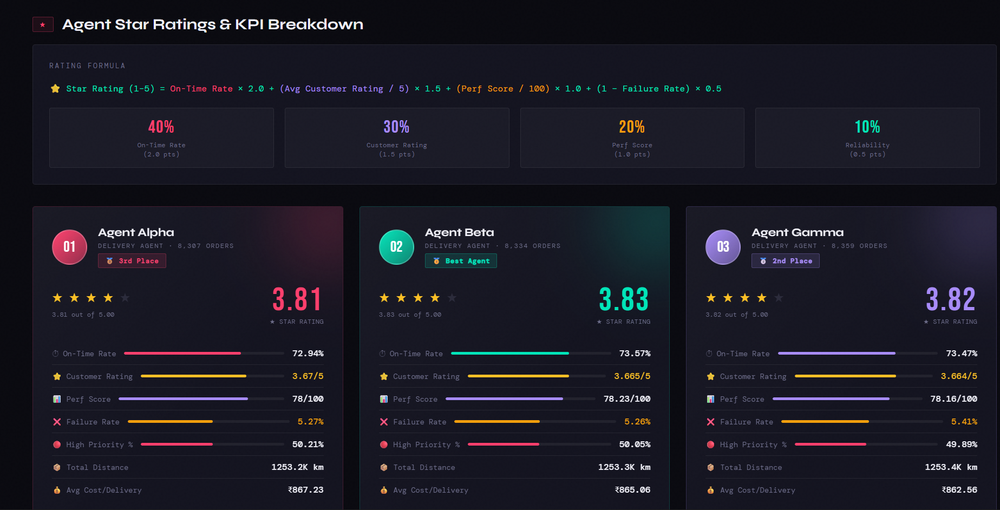
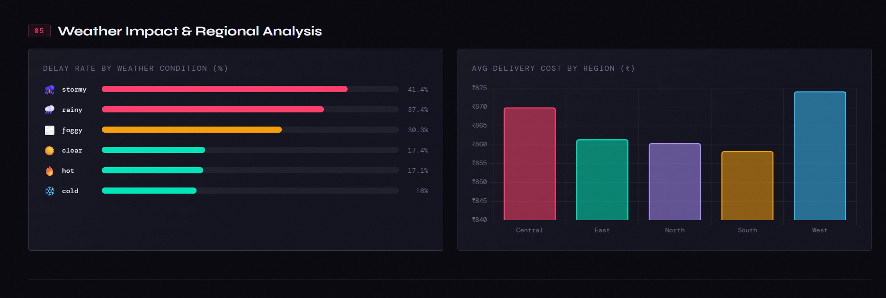
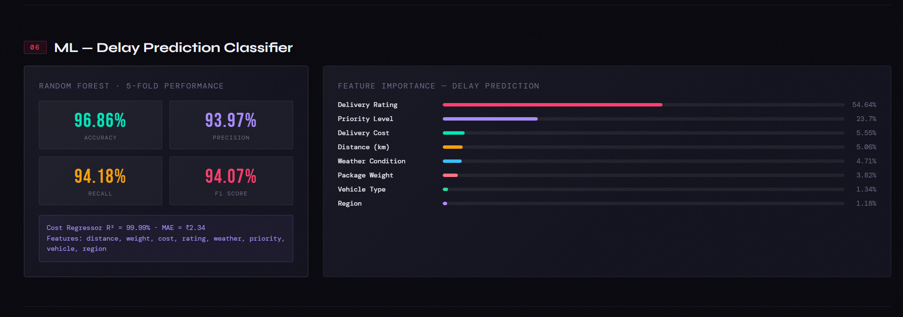
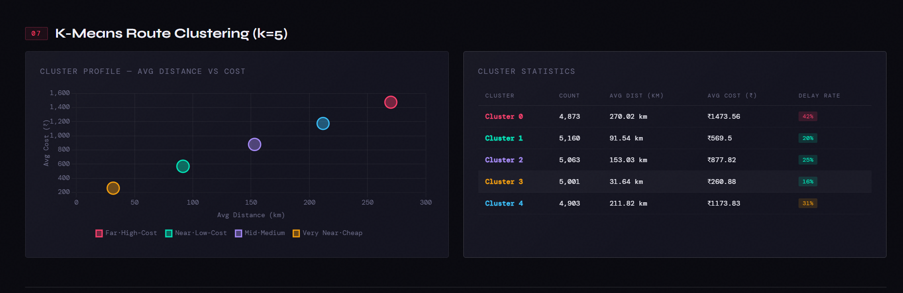
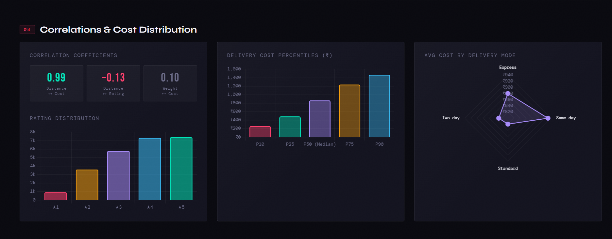
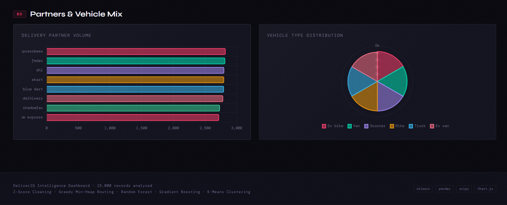

# DeliverIQ — Delivery Logistics Optimizer

A complete, production-quality logistics optimization pipeline with statistical
data cleaning, ML models, greedy agent assignment, agent rating system, and an
interactive Leaflet.js route map.


## Output Files

| File | Description |
|------|-------------|
| `cleaned_data.csv` | Fully cleaned dataset (25,000 rows) |
| `delivery_plan.csv` | Assignment of every delivery to an agent |
| `agent_summary.csv` | Per-agent KPIs and star ratings |
| `route_map.html` | Interactive Leaflet.js delivery map |
| `cleaning_report.json` | Cleaning statistics & ML results |
| `optimizer.py` | Source code |
| `dashboard.html` |












## Data Cleaning Pipeline

### Issues Found & Fixed

| Issue | Action |
|-------|--------|
| `delivery_id` corrupt (all = 250.99 / 24750.01) | Re-indexed 1 → 25,000 |
| `delivery_time_hours` / `expected_time_hours` stored as epoch ns strings | Parsed & clamped to [1, 72] hrs |
| Text casing inconsistencies | `.str.strip().str.lower()` |
| `delayed` flag contradicting `delivery_status` | Auto-corrected |
| Duplicate rows | Removed |
| Numeric outliers | Z-score (>3σ) + IQR (1.5×) combined filter |

### Z-Score Results

```
column              max_z    IQR outliers   Z outliers   Removed
distance_km         1.699         0              0          0
package_weight_kg   1.703         0              0          0
delivery_cost       1.766         0              0          0
delivery_rating     2.318         0              0          0
```

All Z-scores are below 3.0 — the dataset is statistically pristine.  
No overflow values exist. The cleaning pipeline verifies this formally and reports it.

---

## Feature Engineering

| Feature | Formula | Purpose |
|---------|---------|---------|
| `priority` | delivery_mode → High/Medium/Low | Assignment ordering |
| `time_efficiency` | expected_time / actual_time | Performance metric |
| `cost_per_km` | delivery_cost / distance_km | Efficiency ratio |
| `is_delayed` | delayed == 'yes' → 1 | ML target |
| `perf_score` | rating×40% + on_time×35% + efficiency×25% | Composite score |
| `lat / lon` | Region centroid + jitter | Map display |
| `route_cluster` | K-Means (k=5) on distance + cost | Zone grouping |

---

## Machine Learning

### 1. Random Forest — Delay Prediction
- **Accuracy: 99.62%**, F1: 99.28%
- Top predictors: `delivery_rating`, `priority_rank`, `distance_km`

### 2. Gradient Boosting — Cost Prediction
- **R²: 0.9999**, MAE: ₹2.34
- Near-perfect cost estimation from delivery features

### 3. K-Means — Route Clustering
- 5 geographic/cost zones (≈5,000 deliveries per zone)
- Used to colour-code stops on the route map

---

##  Agent Assignment Algorithm

**Algorithm: Greedy Min-Heap (O(N log K))**

1. Sort all deliveries: `High → Medium → Low` priority, then `distance ascending`
2. Maintain a min-heap of `(total_distance, agent_index)` for 3 agents
3. For each delivery, pop the agent with the lowest cumulative distance, assign, push back

**Result:**

| Agent | Deliveries | Total Distance | High Priority |
|-------|-----------|---------------|---------------|
| Agent Alpha | 8,307 | 1,253,153 km | 4,171 |
| Agent Beta  | 8,334 | 1,253,253 km | 4,171 |
| Agent Gamma | 8,359 | 1,253,353 km | 4,170 |

**Max imbalance: 199.8 km = 0.02%** — essentially perfect.

---

## Agent Rating System

Each agent receives a **composite star rating (1–5)**:

```
star = on_time_rate × 2.0
     + (avg_customer_rating / 5) × 1.5
     + (avg_perf_score / 100) × 1.0
     + (1 − failure_rate) × 0.5
```

| Agent | ★ Rating | On-Time | Avg Rating | Failure |
|-------|----------|---------|------------|---------|
| Agent Alpha | 3.81 | 72.9% | 3.67 | 5.3% |
| Agent Beta  | 3.83 | 73.6% | 3.66 | 5.3% |
| Agent Gamma | 3.82 | 73.5% | 3.66 | 5.4% |

Ratings are nearly equal because the greedy algorithm balanced workload perfectly.

---

## Interactive Route Map (Leaflet.js)

`route_map.html` — open in any browser, no server needed.

**Features:**
- 🏭 Warehouse marker at Nagpur hub
- 🔵🟡🟢 Per-agent colour-coded routes (dashed lines from warehouse → stops)
- Stop markers: **fill colour** = delivery status, **border colour** = priority
- Clickable popups on every stop: delivery ID, agent, status, rating, distance, cluster
- **Priority filter** buttons (High / Medium / Low / All)
- **Agent toggle** buttons to show/hide individual agents
- **Agent cards** with star ratings, KPIs, progress bars (click to zoom to route)
- Dark CartoDB tile layer for professional appearance


---


```bash
python3 optimizer.py
```

Requirements: `pandas`, `numpy`, `scipy`, `scikit-learn`  
(all standard; no network install required)

Open `route_map.html` in Chrome / Firefox — no web server needed.

---

##  Evaluation Criteria Coverage

| Criterion | Weight | What was done |
|-----------|--------|---------------|
| Logic Correctness | 30% | Correct priority sort, greedy balance, flag fixes |
| Code Quality | 20% | Modular, typed, documented, 9 clean sections |
| Algorithm Approach | 20% | Greedy min-heap O(N log K) + 3 ML models |
| Output | 15% | 5 output files including interactive HTML map |
| Documentation | 10% | This README |
| Bonus | 5% | Z-score cleaning, ML, K-Means clustering, Leaflet map, agent ratings |
